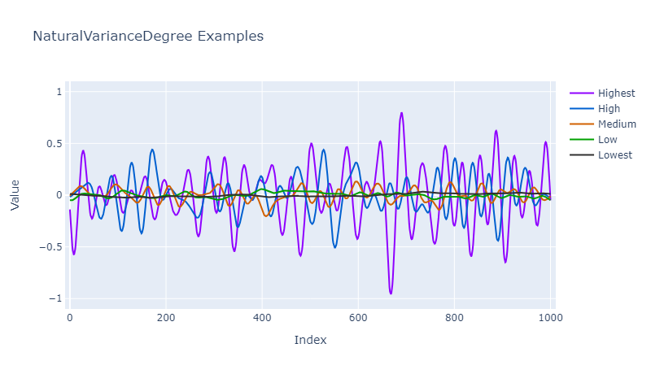

# QuickData.Numbers.FSharp

# NaturalVarianceDegree

Defines the 'strength' of noise by which values can vary.

- The [NaturalVarianceDegree Type](#the-naturalvariancedegree-type)
- The [NaturalVarianceDegree Module](#the-naturalvariancedegree-module)
- [Discriminated Union Identity Values](#discriminated-union-identity-values)
- [Exception-free Processing](#exception-free-processing)
- [Issues, Questions, and Suggestions](#issues-questions-and-suggestions)

> **Note:** See the `QuickData.Core.FSharp` [documentation](https://github.com/GarryPatchett/QuickData.FSharp "Home page for the QuickData project") for more information about the Variance type.

## The NaturalVarianceDegree Type

The `NaturalVarianceDegree` **type** defines a discriminated union used to specify the 'strength' of noise by which values can vary.

The cases are:

| Case Name                     | Amount Of Noise                                                   | Amount **2* |
| ----------------------------- | ----------------------------------------------------------------- | ----------- |
| **Lowest**                    | The lowest amount of noise (very small amount)                    | +/- 0.03    |
| **Low**                       | A low amount of noise (not very much)                             | +/- 0.06    |
| **Medium** **1*               | A decent amount of noise (sometimes quite a bit)                  | +/- 0.17    |
| **High**                      | A high amount of noise (a decent amount)                          | +/- 0.48    |
| **Highest**                   | The highest amount of noise (a lot)                               | +/- 0.95    |

- **1* : The default case.
- **2* : The approximate maximum/minimum amount that a value can vary.

To specify a natural variance degree simply supply its name, such as `NaturalVarianceDegree.Low`.

The difference between these cases can sometimes be subtle so it is recommended that you experiment to see which is best
for your particular requirements with the data you are processing.

## The NaturalVarianceDegree Module

The `NaturalVarianceDegree` **module** defines functions for working with natural variance degrees.

The functions are:

Returns a string containing...

- `colourName` : ...the name of the (approximate) 'noise colour' related
                 to the degree, which can be used for display purposes;
- `hexColourString` : ...the hex colour related to the degree, which can be
                      used in some graphing APIs.

> **Note:** Neither of these functions will be of much use for most people in most situations but they are there if needed.

## Discriminated Union Identity Values

Functions are available for converting to and from POCO types and DU cases.
See the [overview documentation](000-Overview.md "Package overview") for more information about these.

## Exception-free Processing

Exception-free processing versions - FailSafe, Option, and Result - of some functions are available.
See the [overview documentation](000-Overview.md "Package overview") for more information about these.

## Issues, Questions, and Suggestions

You can visit the *[QuickData.FSharp](https://github.com/GarryPatchett/QuickData.FSharp "Home page for the QuickData project")* GitHub repository to report issues, 
ask questions, or make suggestions. You can also read about the changes across different versions in the release notes there.