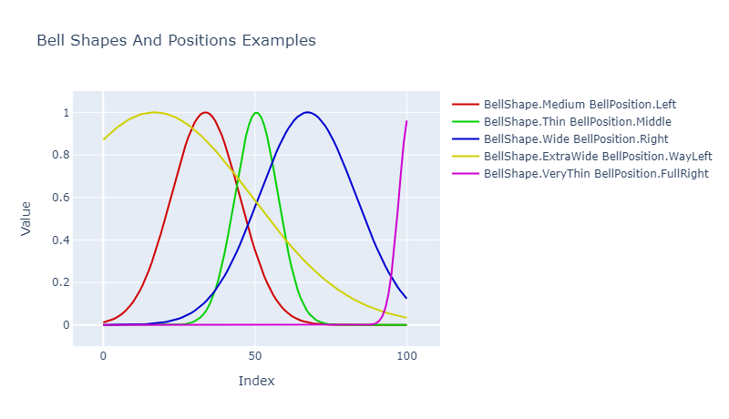

# QuickData.Numbers.FSharp

# Bells

These types define how a bell curve looks.

- The [BellShape Type](#the-bellshape-type)
- The [BellShape Module](#the-bellshape-module)
- The [BellPosition Type](#the-bellposition-type)
- The [BellPosition Module](#the-bellposition-module)
- [Discriminated Union Identity Values](#discriminated-union-identity-values)
- [Exception-free Processing](#exception-free-processing)
- [Issues, Questions, and Suggestions](#issues-questions-and-suggestions)

> **Note:** Some combinations of bell shapes and bell positions may, as can be seen in the above graph, produce values which
do not reach either down to 0.0 or up to +1.0, or both.

## The BellShape Type

The `BellShape` **type** defines a discriminated union used to specify the shape of a bell curve.

The cases are:

| Case Name                     | Shape Of Bell                                                     |
| ----------------------------- | ----------------------------------------------------------------- |
| **VeryThin**                  | A very thin bell shape (more like a 'blip')                       |
| **Thin**                      | A thin bell shape                                                 |
| **Medium** **1*               | A medium width bell shape                                         |
| **Wide**                      | A wide bell shape                                                 |
| **VeryWide**                  | A very wide bell shape                                            |
| **ExtraWide**                 | An extra-wide bell shape (more like a 'wave')                     |

- **1* : The default case.

To specify a bell shape simply supply its name, such as `BellShape.Thin`.

## The BellShape Module

The `BellShape` **module** defines functions for working with bell shapes.

The functions are:

- `hexColourString` : Returns a string containing the hex colour related to the shape, which can be
                      used in some graphing APIs.

> **Note:** This function will not be of much use for most people in most situations but it's there if needed.

## The BellPosition Type

The `BellPosition` **type** defines a discriminated union used to specify the position of a bell curve.

The cases are:

| Case Name                     | Position Of Bell                                                  |
| ----------------------------- | ----------------------------------------------------------------- |
| **FullLeft**                  | As far to the left (x-axis origin) as possible                    |
| **WayLeft**                   | Quite far to the left                                             |
| **Left**                      | To the left                                                       |
| **Middle** **2*               | In the middle                                                     |
| **Right**                     | To the right                                                      |
| **WayRight**                  | Quite far to the right                                            |
| **FullRight**                 | As far to the right as possible                                   |

- **2* : The default case.

To specify a bell position simply supply its name, such as `BellPosition.Left`.

## The BellPosition Module

The `BellPosition` **module** defines functions for working with bell positions.

The functions are:

- `hexColourString` : Returns a string containing the hex colour related to the position, which can be
                      used in some graphing APIs.

> **Note:** This function will not be of much use for most people in most situations but it's there if needed.

## Discriminated Union Identity Values

Functions are available for converting to and from POCO types and DU cases.
See the [overview documentation](000-Overview.md "Package overview") for more information about these.

## Exception-free Processing

Exception-free processing versions - FailSafe, Option, and Result - of some functions are available.
See the [overview documentation](000-Overview.md "Package overview") for more information about these.

## Issues, Questions, and Suggestions

You can visit the *[QuickData.FSharp](https://github.com/GarryPatchett/QuickData.FSharp "Home page for the QuickData project")* GitHub repository to report issues, 
ask questions, or make suggestions. You can also read about the changes across different versions in the release notes there.