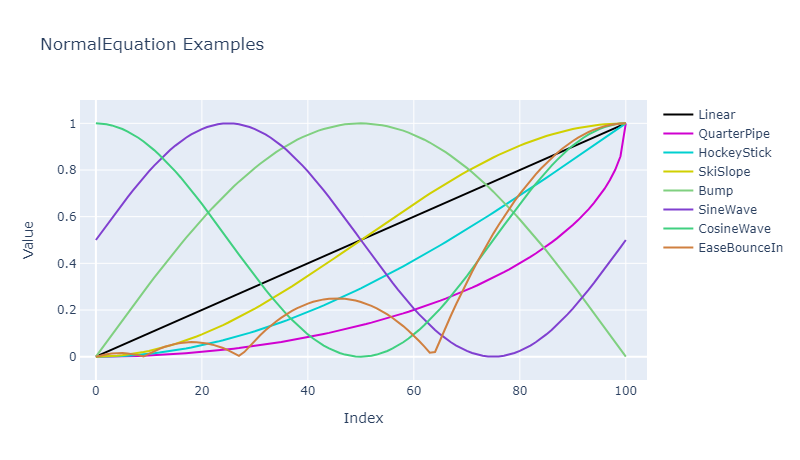

# QuickData.Numbers.FSharp

# NormalEquation

This type defines various equations for use when generating values.

- The [NormalEquation Type](#the-normalequation-type)
- [Discriminated Union Identity Values](#discriminated-union-identity-values)
- [Exception-free Processing](#exception-free-processing)
- [Issues, Questions, and Suggestions](#issues-questions-and-suggestions)

## The NormalEquation Type

The `NormalEquation` **type** defines a discriminated union used to specify the equation to use when generating values.

The basic cases are:

| Case Name                     | Equation Produces Sequence Of Values Which                                                                                            |
| ----------------------------- | ------------------------------------------------------------------------------------------------------------------------------------- |
| **Linear** **1*               | Increase linearly from 0.0 to +1.0 (inclusive)                                                                                        |
| **QuarterPipe**               | Resembles the lower-right quarter of a circle                                                                                         |
| **HockeyStick**               | Resembles a hockey stick with the toe on the ground pointing to the left                                                              |
| **SkiSlope**                  | Flattens at the bottom, centre, and top                                                                                               |
| **Bump**                      | Looks like a bump                                                                                                                     |
| **SineWave**                  | Looks like part of a sine equation from 0.0 to 2*PI but 'raised' by 0.5                                                               |
| **CosineWave**                | Looks like part of a cosine equation from 0.0 to 2*PI but 'raised' by 0.5                                                             |

The Sine cases are:

| Case Name                     | Equation Produces Sequence Of Values Which                                                                                            |
| ----------------------------- | ------------------------------------------------------------------------------------------------------------------------------------- |
| **EaseSineIn**                | Is a slow curve at the start tending to almost straight at the end (a bit like `HockeyStick`)                                         |
| **EaseSineOut**               | Is a curve which is almost straight at the start with a slow curve at the end (a bit like `HockeyStick` flipped diagonally)           |
| **EaseSineInOut**             | Is a curve which flattens at the bottom, centre, and top (a bit like `SkiSlope`)                                                      |

The Cubic cases are:

| Case Name                     | Equation Produces Sequence Of Values Which                                                                                            |
| ----------------------------- | ------------------------------------------------------------------------------------------------------------------------------------- |
| **EaseCubicIn**               | Is like `EaseSineIn` but with more curve                                                                                              |
| **EaseCubicOut**              | Is like `EaseSineOut` with more curve                                                                                                 |
| **EaseCubicInOut**            | Is like `EaseSineInOut` but with more curve                                                                                           |

The Quint cases are:

| Case Name                     | Equation Produces Sequence Of Values Which                                                                                            |
| ----------------------------- | ------------------------------------------------------------------------------------------------------------------------------------- |
| **EaseQuintIn**               | Is like `EaseCubicIn` but with more curve                                                                                             |
| **EaseQuintOut**              | Is like `EaseCubicOut` but with more curve                                                                                            |
| **EaseQuintInOut**            | Is like `EaseCubicInOut` but with more curve                                                                                          |

The Circ cases are:

| Case Name                     | Equation Produces Sequence Of Values Which                                                                                            |
| ----------------------------- | ------------------------------------------------------------------------------------------------------------------------------------- |
| **EaseCircIn**                | Is a curve which resembles the lower-right quarter of a circle (a bit like `QuarterPipe`)                                             |
| **EaseCircOut**               | Is a curve which resembles the upper-left quarter of a circle (a bit like `QuarterPipe` flipped diagonally)                           |
| **EaseCircInOut**             | Is a slow curve at the start tending to almost straight at the end (a bit like `EaseQuintInOut` but with more curve)                  |

The Quad cases are:

| Case Name                     | Equation Produces Sequence Of Values Which                                                                                            |
| ----------------------------- | ------------------------------------------------------------------------------------------------------------------------------------- |
| **EaseQuadIn**                | Is like `EaseSineIn` but with a little more curve                                                                                     |
| **EaseQuadOut**               | Is like `EaseSineOut` but with a little more curve                                                                                    |
| **EaseQuadInOut**             | Is like `EaseSineInOut` but with a little more curve                                                                                  |

The Quart cases are:

| Case Name                     | Equation Produces Sequence Of Values Which                                                                                            |
| ----------------------------- | ------------------------------------------------------------------------------------------------------------------------------------- |
| **EaseQuartIn**               | Is like `EaseCubicIn` but with more curve                                                                                             |
| **EaseQuartOut**              | Is like `EaseCubicOut` but with more curve                                                                                            |
| **EaseQuartInOut**            | Is like `EaseCubicInOut` but with more curve                                                                                          |

The Expo cases are:

| Case Name                     | Equation Produces Sequence Of Values Which                                                                                            |
| ----------------------------- | ------------------------------------------------------------------------------------------------------------------------------------- |
| **EaseExpoIn**                | Is like `EaseQuartIn` but with more curve                                                                                             |
| **EaseExpoOut**               | Is like `EaseQuartOut` but with more curve                                                                                            |
| **EaseExpoInOut**             | Is like `EaseQuartInOut` but with more curve                                                                                          |

The Bounce cases are:

| Case Name                     | Equation Produces Sequence Of Values Which                                                                                            |
| ----------------------------- | ------------------------------------------------------------------------------------------------------------------------------------- |
| **EaseBounceIn**              | Is a curve which performs progressively larger 'hops' until it reaches the maximum value                                              |
| **EaseBounceOut**             | Is a curve which performs progressively smaller 'upside-down hops' until it reaches the maximum value                                 |
| **EaseBounceInOut**           | Is a curve which looks like `EaseBounceIn` followed by `EaseBounceOut`                                                                |

- **1* : The default case.

To specify an equation simply supply its name, such as `NormalEquation.Linear`.

## Discriminated Union Identity Values

Functions are available for converting to and from POCO types and DU cases.
See the [overview documentation](000-Overview.md "Package overview") for more information about these.

## Exception-free Processing

Exception-free processing versions - FailSafe, Option, and Result - of some functions are available.
See the [overview documentation](000-Overview.md "Package overview") for more information about these.

## Issues, Questions, and Suggestions

You can visit the *[QuickData.FSharp](https://github.com/GarryPatchett/QuickData.FSharp "Home page for the QuickData project")* GitHub repository to report issues, 
ask questions, or make suggestions. You can also read about the changes across different versions in the release notes there.