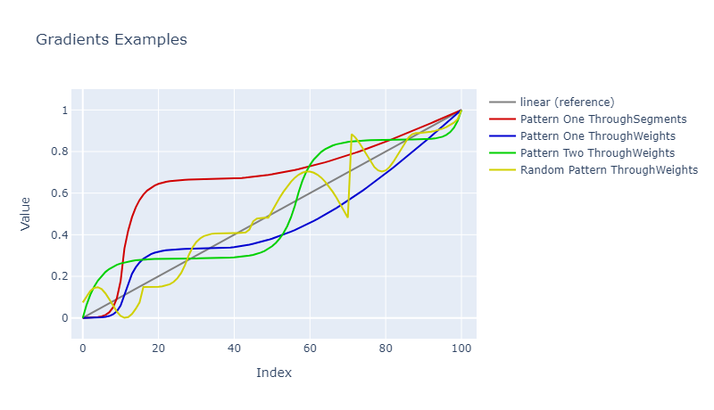

# QuickData.Numbers.FSharp

# Gradients

These types define how a gradient will be generated.

A gradient is made from one or more segments, each of which defines how the generated values change.

- The [GradientSegment Type](#the-gradientsegment-type)
- The [GradientSegment Module](#the-gradientsegment-module)
    - [Construction Functions](#gradient-segment-construction-functions) with [code examples](#gradient-segment-construction-code-examples)
    - [Deconstruction Functions](#gradient-segment-deconstruction-functions)
    - [Variation Functions](#gradient-segment-variation-functions)
- The [GradientOrientation Type](#the-gradientorientation-type)
    - [Discriminated Union Identity Values](#discriminated-union-identity-values)
    - [Exception-free Processing](#exception-free-processing)
- The [GradientPattern Type](#the-gradientpattern-type)
- The [GradientPattern Module](#the-gradientpattern-module)
    - [Construction Functions](#gradient-pattern-construction-functions) with [code examples](#gradient-pattern-construction-code-examples)
    - [Deconstruction Functions](#gradient-pattern-deconstruction-functions)
    - [Variation Functions](#gradient-pattern-variation-functions)
- [Issues, Questions, and Suggestions](#issues-questions-and-suggestions)



## The GradientSegment Type

The `GradientSegment` **type** defines a record used to specify a segment of a gradient.

You cannot create a gradient segment record manually and must, instead, use one of the construction functions as mentioned below.

## The GradientSegment Module

The `GradientSegment` **module** defines functions for working with gradient segments.

### Gradient Segment Construction Functions

The functions are:

Returns a new gradient segment containing...

- `fromEquation` : ...an equation with the default weight of one;
- `fromEquationAndWeight` : ...an equation and the weight to be given to the segment within a pattern;
- `fromEquationAndWeightTuple` : ...an equation and the weight (as a tuple) to be given to the segment within a pattern;

> **Note:** The weight will be clamped to the range of 1 to 9 (inclusive). Any given weight which is less than 1 will be 
inferred to be 1 and any given weight of greater than 9 will be inferred to be 9.

The weight of an individual segment in a gradient pattern (see below) determines how many values will be generated
for that segment relative to the total weights for the pattern.
For example, with a count of 120 and segment weights of 2, 1, and 3 (in that order), the total weight
will be 6 (= 2 + 1 + 3), and the first segment will have 40 values (= 120 / 6 * 2), the second segment will
have 20 values (= 120 / 6 * 1), and the third segment will have 60 values (= 120 / 6 * 3). Thus: 40 + 20 + 60 = 120.

#### Gradient Segment Construction Code Examples

```fsharp 
let quarterPipeOne = 
    GradientSegment.fromEquation NormalEquation.QuarterPipe

let linearTwo = 
    GradientSegment.fromEquationAndWeight NormalEquation.Linear 2

let hockeyStickThree = 
    GradientSegment.fromEquationAndWeightTuple (NormalEquation.HockeyStick, 3)
```

### Gradient Segment Deconstruction Functions

There are no deconstruction functions; once you have created a gradient segment you can only use it.

### Gradient Segment Variation Functions

Gradient segments, once constructed, cannot be modified. If you need to use a different segment then just create a new segment.

## The GradientOrientation Type

The `GradientOrientation` **type** defines a discriminated union used to specify the orientation of a gradient.

The cases are:

| Case Name                         | The Values In The Gradient Will Be                                |
| --------------------------------- | ----------------------------------------------------------------- |
| **SpreadThroughWeights** **1*     | Spread through the gradient by their relative weights             |
| **SpreadThroughSegments**         | Spread through the gradient by segment                            |

- **1* : The default case.

To specify a gradient orientation simply supply its name, such as `GradientOrientation.SpreadThroughWeights`.

### Discriminated Union Identity Values

Functions are available for converting to and from POCO types and DU cases.
See the [overview documentation](000-Overview.md "Package overview") for more information about these.

### Exception-free Processing

Exception-free processing versions - FailSafe, Option, and Result - of some functions are available.
See the [overview documentation](000-Overview.md "Package overview") for more information about these.

## The GradientPattern Type

The `GradientPattern` **type** defines a record used to specify a gradient pattern.

You cannot create a gradient patternt record manually and must, instead, use one of the construction functions as mentioned below.

## The GradientPattern Module

The `GradientPattern` **module** defines functions for working with gradient patterns.

### Gradient Pattern Construction Functions

The functions are:

Returns a new gradient pattern containing...

- `fromSingleSegment` : ...a single gradient segment;
- `fromSegments` : ...multiple gradient segments (a gradient pattern which has been created with no
                    segments - an empty list - will produce no values).

#### Gradient Pattern Construction Code Examples

```fsharp 
// A verbose way to create a pattern.

let verbosePattern =
    GradientPattern.fromSingleSegment (GradientSegment.fromEquationAndWeight NormalEquation.EaseExpoIn 1)
    |> GradientPattern.append (GradientSegment.fromEquationAndWeight NormalEquation.EaseExpoOut 2)
    |> GradientPattern.append (GradientSegment.fromEquationAndWeight NormalEquation.HockeyStick 6)

// A nicer way to create the same pattern.

let nicerPattern =
    seq {
        NormalEquation.EaseExpoIn, 1
        NormalEquation.EaseExpoOut, 2
        NormalEquation.HockeyStick, 6
    }
    |> Seq.map GradientSegment.fromEquationAndWeightTuple
    |> GradientPattern.fromSegments
```

### Gradient Pattern Deconstruction Functions

There are no deconstruction functions; once you have created a gradient pattern you cannot deconstruct it.

### Gradient Pattern Variation Functions

The functions are:

- `append` : Returns a new gradient pattern containing the segment(s) from the original pattern and the new segment, in that order.

## Issues, Questions, and Suggestions

You can visit the *[QuickData.FSharp](https://github.com/GarryPatchett/QuickData.FSharp "Home page for the QuickData project")* GitHub repository to report issues, 
ask questions, or make suggestions. You can also read about the changes across different versions in the release notes there.