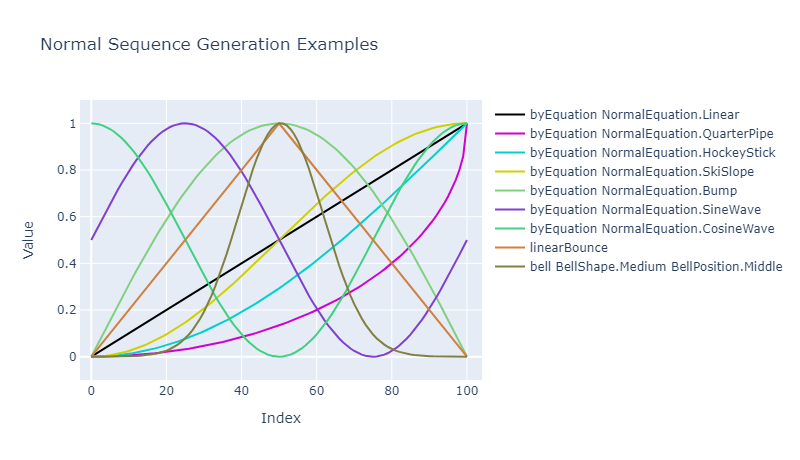
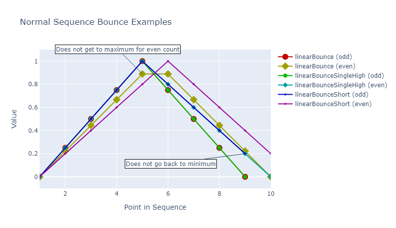
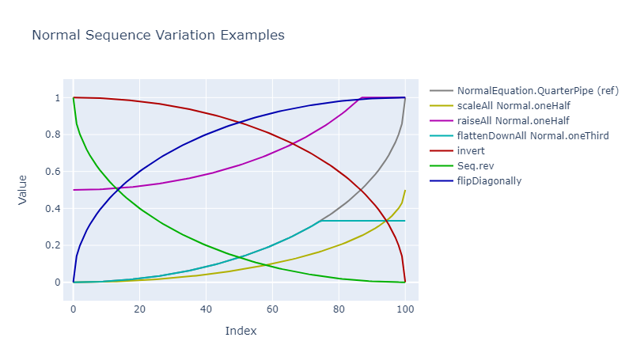
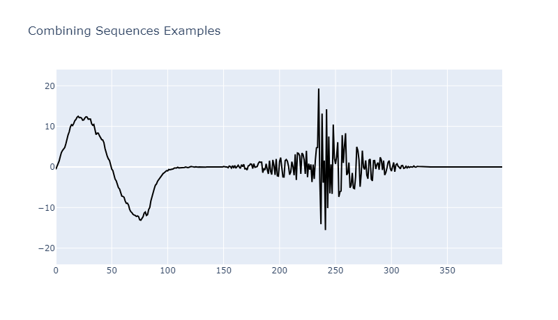

# QuickData.Numbers.FSharp

# Normal.Seq

This module lets you generate sequences of Normal.

- The [Normal.Seq Module](#the-normalseq-module)
    - [Construction Functions](#construction-functions) with [code examples](#construction-code-examples)
    - [Deconstruction Functions](#deconstruction-functions) with [code examples](#deconstruction-code-examples)
    - [Generation Functions](#generation-functions) with [code examples](#generation-code-examples)
    - [Variation Functions](#variation-functions) with [code examples](#variation-code-examples)
    - [Ready-made Sequences](#ready-made-sequences)
    - [Combining Sequences](#combining-sequences)
- [Exception-free Processing](#exception-free-processing)
- [Issues, Questions, and Suggestions](#issues-questions-and-suggestions)

> **Note:** See the the documentation [here](../QuickData.Core.FSharp/010-Normal.md "The Normal Type") for more information about the Normal type.

## The Normal.Seq Module

The `Normal.Seq` **module** defines functions for working with sequences of Normal.

### Construction Functions

The functions are:

Returns a new sequence whose elements are...

- `fromFloats` : ...the results of making a Normal from a float in the original sequence;
- `fromFloatsSpread` : ...the results of making a Normal
                        from a float in the original sequence according to the specified range;
- `fromBooleans` : ...the results of converting each boolean element in the input sequence to a Normal.

#### Construction Code Examples

```fsharp 
let fromFloats = 
    seq { 0.5 ; 0.2 ; 0.6 } 
    |> Normal.Seq.fromFloats 
    // -> seq { N0.5 ; N0.2 ; N0.6 }

let normalisationRange = NormalisationRange.fromFloats 0.0 100.0 

let fromFloatsSpread = 
    seq { 10.0 ; 50.0 ; 90.0 }
    |> Normal.Seq.fromFloatsSpread normalisationRange 
    // -> seq { N0.1 ; N0.5 ; N0.9 }

let fromBooleans = 
    seq { false ; true ; false ; true }
    |> Normal.Seq.fromBooleans 
    // -> seq { N0.0 ; N1.0 ; N0.0 ; N1.0 }
```

### Deconstruction Functions

The functions are:

Returns a new sequence...

- `denormalise` : ...of float where each Normal in the input sequence has been denormalised
                    according to the specified range;
- `toFloats` : ...whose elements are the results of obtaining the inner value
                of a Normal in the original sequence;
- `toBooleans` : ...whose elements are the results of converting each Normal
                    element in the input sequence to a boolean;
- `toVariances` : ...whose elements are the results of converting each element
                    in the input sequence to a Variance;
- `toVariancesSpread` : ...whose elements are the results of converting each element
                        in the input sequence to a Variance.

#### Deconstruction Code Examples

```fsharp 
let normals = 
    seq { 0.2 ; 0.3 ; 0.6 ; 0.9 ; 1.0 }
    |> Normal.Seq.fromFloats 
    // -> seq { N0.2 ; N0.3 ; N0.6 ; N0.9 ; N1.0 }

let floats = 
    normals 
    |> Normal.Seq.toFloats
    // -> seq { 0.2 ; 0.3 ; 0.6 ; 0.9 ; 1.0 }

let booleans = 
    normals 
    |> Normal.Seq.toBooleans
    // -> seq { false ; false ; true ; true ; true }

let variances = 
    normals 
    |> Normal.Seq.toVariances
    // -> seq { V0.2 ; V0.3 ; V0.6 ; V0.9 ; V1.0 }

let variancesSpread = 
    normals 
    |> Normal.Seq.toVariancesSpread
    // -> seq { V-0.6 ; V-0.4 ; V0.2 ; V0.8 ; V1.0 }

let denormalisationRange = DenormalisationRange.fromFloats 0.0 100.0

let denormalised = 
    normals 
    |> Normal.Seq.denormalise denormalisationRange
    // -> seq { 20.0 ; 30.0 ; 60.0 ; 90.0 ; 100.0 }
```

### Generation Functions



The functions are (in alphabetical order):

Builds a new sequence...

- `bell` : ...where the values of the elements resemble a bell shape;
- `byEquation` : ...each element of which is generated by the given equation
                    and converted to a Normal;
- `cycled` : ...where the elements in the input sequence are endlessly cycled;
- `gradient` : ...each element of which is generated by the equation(s) in the 
                gradient pattern and converted to a Normal;
- `linearBounce` : ...where the values rise up from 0.0 to +1.0
                    (or sometimes close to +1.0) and then back down to 0.0;
- `linearBounceSingleHigh` : ...where the values rise up from 0.0 to +1.0 and then back down to 0.0;
- `linearBounceShort` : ...where the values rise up from 0.0 to +1.0 and then back down to almost 0.0;
- `random` : ...whose elements are the results of making a Normal
                from a randomly-generated value between 0.0 and +1.0 (inclusive);
- `randomised` : ...of Normal which is generated by choosing randomly
                    from the input sequence of Normal;
- `repeated` : ...which is an endlessly repeated copy of the given Normal;
- `tombola` : ...where the elements in the input sequence are endlessly shuffled.

> **Note:** The three `linearBounce` functions can give slghtly different results under different circumstances.
It is recommended that you choose the one which best satisfies your requirements.



#### Generation Code Examples

```fsharp 
let rng = System.Random.Shared // Any random number generator.

let random = 
    Normal.Seq.random rng 
    |> Seq.take 10 
    // -> e.g. seq { N0.5068077173 ; N0.6579458656 ; N0.8396936031 ; 
    //               N0.6206464583 ; N0.1886282635 ; N0.9739559384 ;
    //               N0.05871926975 ; N0.2904157361 ; N0.3635229664 ;
    //               N0.2958901036 }

let linear = 
    Normal.Seq.byEquation NormalEquation.Linear 11
    // -> seq { N0.0 ; N0.1 ; N0.2 ; N0.3 ; N0.4 ; N0.5 ; N0.6 ; 
    //          N0.7 ; N0.8 ; N0.9 ; N1.0 }

let smoothCurve = 
    Normal.Seq.byEquation NormalEquation.QuarterPipe 10 
    // -> seq { N0.0 ; N0.00619201 ; N0.02500395696 ; N0.05719095842 ;
    //          N0.1041935835 ; N0.1685205807 ; N0.2546440075 ; 
    //          N0.3714606389 ; N0.5418771527 ; N1.0 }

let minAndMax = 
    Normal.Seq.alternatingMinimumMaximum 
    |> Seq.take 5 
    // -> seq { N0.0 ; N1.0 ; N0.0 ; N1.0 ; N0.0 }

let cycled = 
    seq { Normal.oneFifth ; Normal.fourFifths } 
    |> Normal.Seq.cycled 
    |> Seq.take 5 
    // -> seq { N0.2 ; N0.8 ; N0.2 ; N0.8 ; N0.2 }

let tombola = 
    seq { Normal.oneTenth ; Normal.oneHalf ; Normal.threeQuarters } 
    |> Normal.Seq.tombola rng 
    |> Seq.take 10 
    // -> seq { N0.5 ; N0.75 ; N0.1 ; N0.75 ; N0.1 ; N0.5 ; N0.75 ;
    //          N0.1 ; N0.5 ; N0.5 }
```

### Variation Functions



The functions are:

Returns a new sequence...

- `addVariances` : ...whose elements are the results of adding each offset (variance) to the
                    corresponding element in the source input sequence;
- `scaleAll` : ...whose elements are the results of scaling each element in the input
                sequence by the given magnitude;
- `scale` : ...whose elements are the results of scaling each element in the source sequence
            by the corresponding magnitude in the magnitudes sequence;
- `doubleAll` : ...whose elements are the results of doubling the value of each element
                in the source sequence;
- `raiseAll` : ...where each element in the input sequence is raised by the given amount;
- `raise` : ...where each element in the source sequence is raised by the corresponding
            amount in the amounts sequence;
- `lowerAll` : ...where each element in the input sequence is lowered by the given amount;
- `lower` : ...where each element in the source sequence is lowered by the corresponding
            amount in the amounts sequence;
- `flattenDownAll` : ...where each element in the input sequence is flattened down to the given level;
- `flattenDown` : ...where each element in the source sequence is flattened down to the
                    corresponding level in the levels sequence;
- `flattenUpAll` : ...where each element in the input sequence is flattened up to the given level;
- `flattenUp` : ...where each element in the source sequence is flattened up to the corresponding
                level in the levels sequence;
- `invert` : ...wWhose elements are the results of inverting each element in the input sequence;
- `flipDiagonally` : ...whose elements are the results of inverting each element in the input sequence, and then reversing the sequence.

#### Variation Code Examples

```fsharp 
let originals = 
    Normal.Seq.byEquation NormalEquation.SineWave 50 
    // -> seq { N0.5 ; N0.5639385808 ; N0.626827292 ; N0.6876335024 ; etc. }

let scaledByHalf = 
    originals 
    |> Normal.Seq.scaleAll Normal.oneHalf 
    // -> seq { N0.25 ; N0.2819692904 ; N0.313413646 ; N0.3438167512 ; etc. }

let flattenedDown = 
    originals 
    |> Normal.Seq.flattenDownAll Normal.twoThirds
    // -> seq { N0.5 ; N0.5639385808 ; N0.626827292 ; N0.6666666667 ; etc. }

let reversed = originals |> Seq.rev // Note: Just Seq, not Normal.Seq

let inverted = 
    originals 
    |> Normal.Seq.invert 
    // -> seq { N0.5 ; N0.4360614192 ; N0.373172708 ; N0.3123664976 ; etc. }
```

### Ready-made Sequences

Various ready-made sequences are available, and these are:

Endlessly repeated copy (giving an infinite sequence) of...

- `repeatedMinimum` : ...Normal.minimum;
- `repeatedOneTenth` : ...Normal.oneTenth;
- `repeatedOneFifth` : ...Normal.oneFifth;
- `repeatedOneQuarter` : ...Normal.oneQuarter;
- `repeatedTwoFifths` : ...Normal.twoFifths;
- `repeatedOneThird` : ...Normal.oneThird;
- `repeatedOneHalf` : ...Normal.oneHalf;
- `repeatedThreeFifths` : ...Normal.threeFifths;
- `repeatedTwoThirds` : ...Normal.twoThirds;
- `repeatedThreeQuarters` : ...Normal.threeQuarters;
- `repeatedFourFifths` : ...Normal.fourFifths;
- `repeatedMaximum` : ...Normal.maximum;

Endlessly cycle (giving an infinite sequence) of...

- `alternatingMinimumMaximum` : ...Normal.minimum and Normal.maximum;
- `cycledMinimumHalfMaximum` : ...Normal.minimum, Normal.oneHalf, and Normal.maximum;

Endlessly randomised (giving an infinite sequence) of...

- `randomisedMinimumMaximum` : ...randomly-chosen Normal.minimum or Normal.maximum.

> **Note:** A random number generator is required for the above sequence.

Endlessly shuffle (giving an infinite sequence) of...

- `tombolaMinimumMaximum` : ...Normal.minimum and Normal.maximum;
- `tombolaHalves` : ...Normal.minimum, Normal.oneHalf, and Normal.maximum;
- `tombolaThirds` : ...Normal.minimum, Normal.oneThird, Normal.twoThirds, and Normal.maximum;
- `tombolaQuarters` : ...Normal.minimum, Normal.oneQuarter, Normal.oneHalf, Normal.twoQuarters, and Normal.maximum;
- `tombolaFifths` : ...Normal.minimum, Normal.oneFifth, Normal.twoFifths, Normal.threeFifths, Normal.fourFifths, and Normal.maximum.

> **Note:** A random number generator is required for the above tombola sequences.

### Combining Sequences 



The generated sequences can either be used individually or they can be combined in various ways to acheive something more interesting.

For example, the following code produces a long sequence where a signal is oscillating nicely - with a bit of noise - but then fades out
to no signal (still with a bit of noise), and then ramps up randomly a little, and then has a big random burst which fades out, and 
then the signal falls to a flat zero.

```fsharp 
// Randomly-chosen seed - try different seed values for different sequences.
let rng = System.Random 56370 

// This sequence truncates the below oscillating sequence early by being shorter.
let oscillatorNoise = 
    Variance.Seq.natural rng NaturalVarianceDegree.Low 85 

let nicelyOscillatingButNoisySignal = 
    Normal.Seq.byEquation NormalEquation.SineWave 100 
    |> Variance.Seq.fromNormalsSpread 
    |> Variance.Seq.scaleAll Normal.oneHalf  
    |> Variance.Seq.add oscillatorNoise 

let fadeOut = 
    Normal.Seq.byEquation NormalEquation.QuarterPipe 100 
    |> Seq.rev 

// This sequence has the same length as the sequence which it will modify.
let signalDropOffNoise = 
    Variance.Seq.natural rng NaturalVarianceDegree.Low 50 
    |> Variance.Seq.scaleAll Normal.oneHalf  
    |> Variance.Seq.scale fadeOut 

let signalDropOff = 
    Normal.Seq.byEquation NormalEquation.EaseExpoIn 50 
    |> Seq.rev 
    |> Variance.Seq.fromNormals 
    |> Variance.Seq.scaleAll Normal.oneThird  
    |> Variance.Seq.invert 
    |> Variance.Seq.add signalDropOffNoise 

let fadeIn = 
    Normal.Seq.byEquation NormalEquation.HockeyStick 100 

// The length of the fadeIn sequence truncates this infinite semiRandom sequence.
let noisySignalIncreasingSlowly = 
    Variance.Seq.semiRandom rng 
    |> Variance.Seq.scaleAll Normal.oneFifth 
    |> Variance.Seq.scale fadeIn 

// The length of the fadeOut sequence truncates this infinite random sequence.
let burstOfNoiseFadingOutSignal = 
    Variance.Seq.random rng 
    |> Variance.Seq.scale fadeOut 

// This sequence is truncated as required when the fullSequence is enumerated.
let lossOfSignal = 
    Normal.Seq.repeatedOneHalf 
    |> Variance.Seq.fromNormalsSpread 

// Join the relevant sequences together in order.
let fullSequence = 
    seq { 
        yield! nicelyOscillatingButNoisySignal 
        yield! signalDropOff 
        yield! noisySignalIncreasingSlowly 
        yield! burstOfNoiseFadingOutSignal 
        yield! lossOfSignal } 

// Create the expansion range with the required magnitudes.
let signalRange = ExpansionRange.fromFloats -24.0 +24.0 

let numberOfValues = 401 

let xAxisValues = seq { 0..(numberOfValues - 1) } 

// Expand the sequence to the necessary range.
let yAxisValues = fullSequence |> Variance.Seq.expand signalRange

// The xAxisValues and yAxisValues can now be passed to a graphing system to draw a graph of the data
//  (as seen in the above example which was drawn with Plotly.NET), for example:
//
// let points = (xAxisValues, yAxisValues) ||> Seq.zip |> Seq.toList 
//
// #r "nuget: Plotly.NET"
//
// Chart.Line(Name = "Combined", xy = points, LineColor = Color.fromHex "000000")
// |> Chart.withTitle "Combining Sequences Examples" 
// |> Chart.withXAxisStyle(TitleText = "", ShowLine = false)
// |> Chart.withYAxisStyle(TitleText = "", ShowLine = false, MinMax = (-24, +24))
// |> Chart.withSize(width = 800, height = 460)
// |> Chart.show
```

## Exception-free Processing

Exception-free processing versions - FailSafe, Option, and Result - of some functions are available.
See the [overview documentation](000-Overview.md "Package overview") for more information about these.

## Issues, Questions, and Suggestions

You can visit the *[QuickData.FSharp](https://github.com/GarryPatchett/QuickData.FSharp "Home page for the QuickData project")* GitHub repository to report issues, 
ask questions, or make suggestions. You can also read about the changes across different versions in the release notes there.